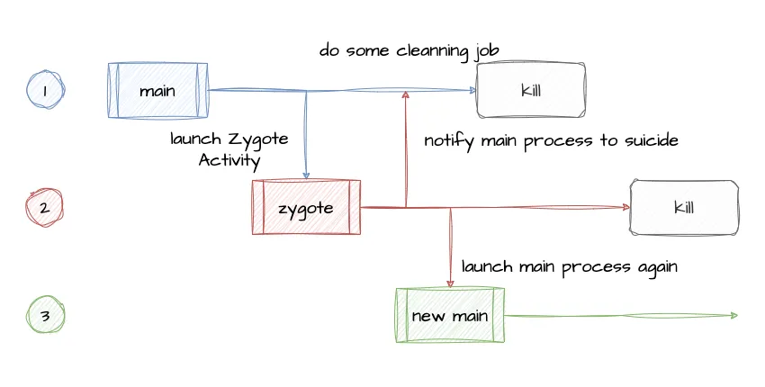

# Zygote

Restart your application programmatically, compact for Android 10(API level 29)

## Sample

| window background      | homepage               | restart homepage       |
|------------------------|------------------------|------------------------|
|  |  |  |

## How it works

Restart main process via sub-process instead of AlarmManager.

